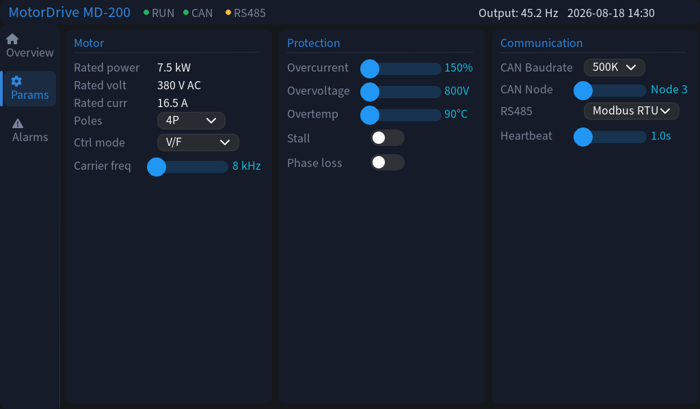
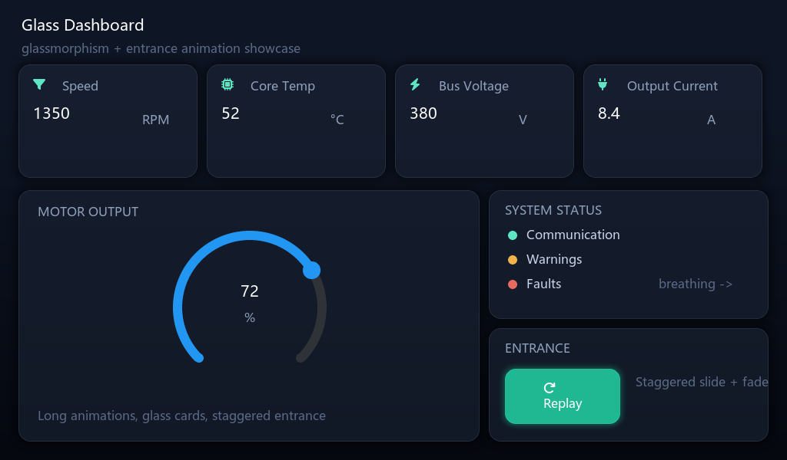
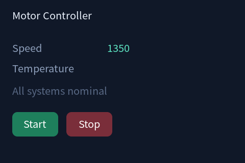
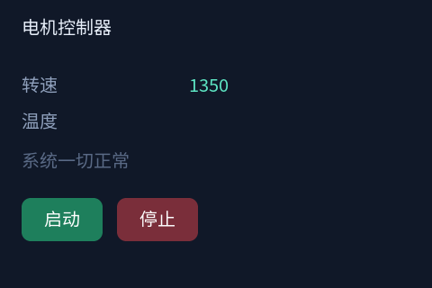
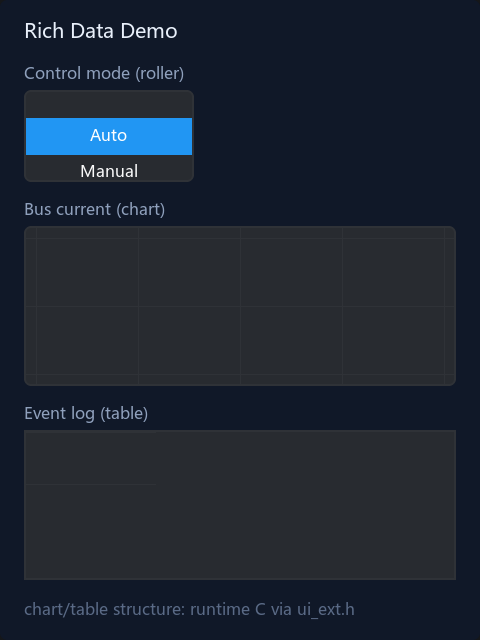
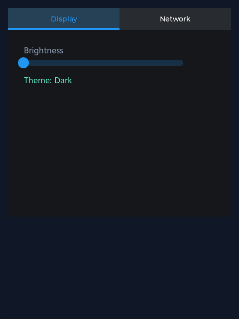

# eezml

EEZ Studio → XML → 固件运行时构建 UI 的完整工具链（自有格式，对标 LVGL Pro 的 XML 动态加载能力）。

```
EEZ Studio 工程 ──eezml_export.py──> eezml (uixml XML)
                                          │
                                    EMBED / 文件系统
                                          ▼
                              firmware/eezml_rt 运行时内核
                              （expat SAX + 对象树构建，纯 C 可移植）
```

## 截图

以下屏幕全部由本工具链生成、经 [MCP screenshot 工具](https://github.com/IWILLTBEST/eez-studio-mcp)拍摄——零手工。

**电机控制器**（`examples/motor-en` 三屏；中文版在 `examples/motor`）：

| 总览 | 参数 | 报警 |
|---|---|---|
|  |  |  |

**玻璃拟态展示**（`examples/glass`——半透明卡片、阴影、渐变底、入场动画编排）：



**国际化，一份源两种语言**（`examples/i18n`——切换 `strings.default` 重编译即可）：

| English | 中文 |
|---|---|
|  |  |

**富数据演示**（`examples/richdata`——roller、仪表、日历、spinbox、键盘、tabview）：

| 主屏 | 控件 | 设置 |
|---|---|---|
|  |  |  |

## 组成

| 目录/文件 | 说明 |
|---|---|
| `eezml_export.py` | .eez-project → uixml XML + assets 清单导出器 |
| `uixml.py` | uixml 格式核心（XML↔IR 双向无损） |
| `ir2eez.py` / `eez2ir.py` | IR ↔ EEZ 工程转换（Import 回流 / 工程解析） |
| `generator.py` | html2eez（HTML → EEZ 工程） |
| `migrate_uixml.py` | JSON IR → uixml 迁移工具 |
| `SKILL.md` | ir2eez 的 AI 技能文档 |
| `firmware/eezml_rt/` | **可移植运行时内核**（纯 C + lvgl + bundled expat，零平台依赖；ESP-IDF 之外的平台直接把源文件加入构建） |
| `vscode/` | VS Code 扩展（双模式预览 / Import / Run） |
| `tools/` | A-WASM 模拟器构建、金标准 CI、视觉回归 |
| `examples/` | glass / i18n / motor / richdata / phase2-demo 示例 |
| `golden/` | 金标准回归数据 |

## 快速上手

```bash
# 导出 eezml
python eezml_export.py your.eez-project -o out_dir

# 固件侧（ESP-IDF）
#   components/ 下放 eezml_rt，main 里：
#   eezml_register_bitmap("bulb", &img_bulb);
#   eezml_create(lv_screen_active(), xml_text);
```

二期行为引擎（变量/绑定/动作）样例见 `examples/phase2-demo.uixml`：
`<var>` 声明变量 → `bind="count"` 挂 lv_observer 绑定 → `on-clicked` 事件 →
声明式 `<anim>`/`<call native>` 步骤 → C 侧 `eezml_get/set_var_int` 驱动 UI 自动刷新。

## 路线图

- **一期（已完成）**：静态 UI（部件+样式+assets）运行时加载，实机验收=双 GIF 画面与 C 导出等价
- **二期（已完成）**：声明式 action（anim/set 等 12 种步骤）+ `bind` 数据绑定（lv_observer）+ 原生 C action 注册表 + 事件桥，实机交互验收通过
- **三期（规划）**：热重载（UART/USB 推 XML 秒级重建）、组件层运行时复用（widget-def）、assets 独立生成器

## 许可

- 本仓工具链代码：随本仓声明
- `firmware/eezml_rt/expat/`：Expat MIT（原样保留版权头，源自 LVGL 9.4 bundled 副本）
